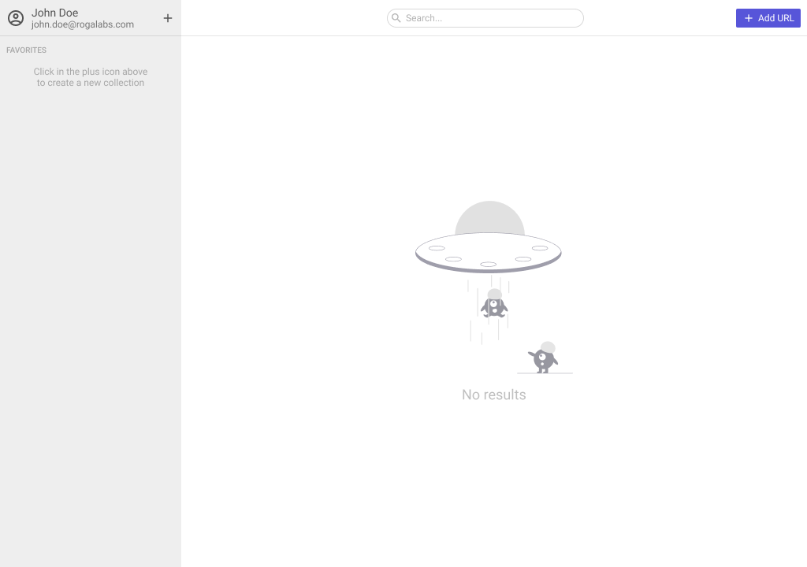
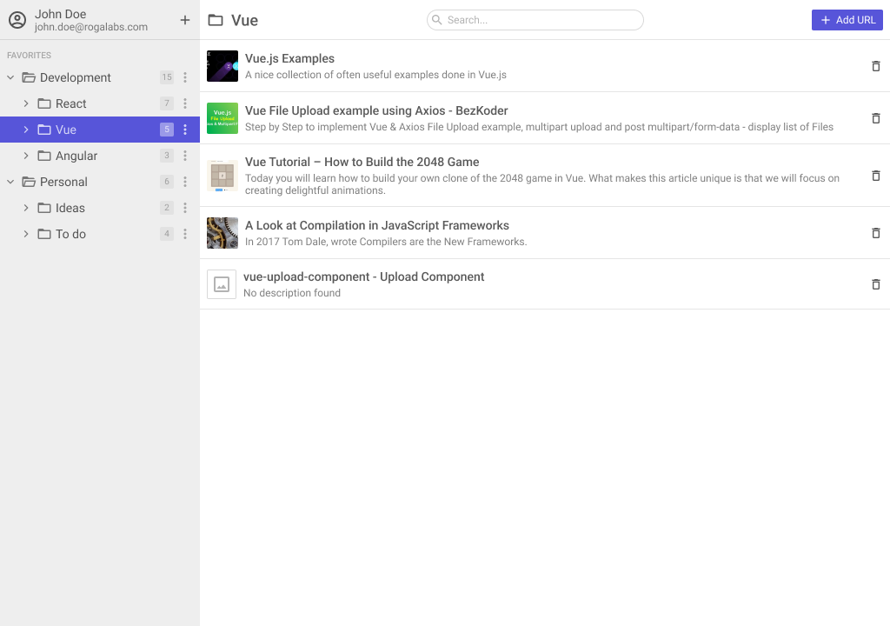
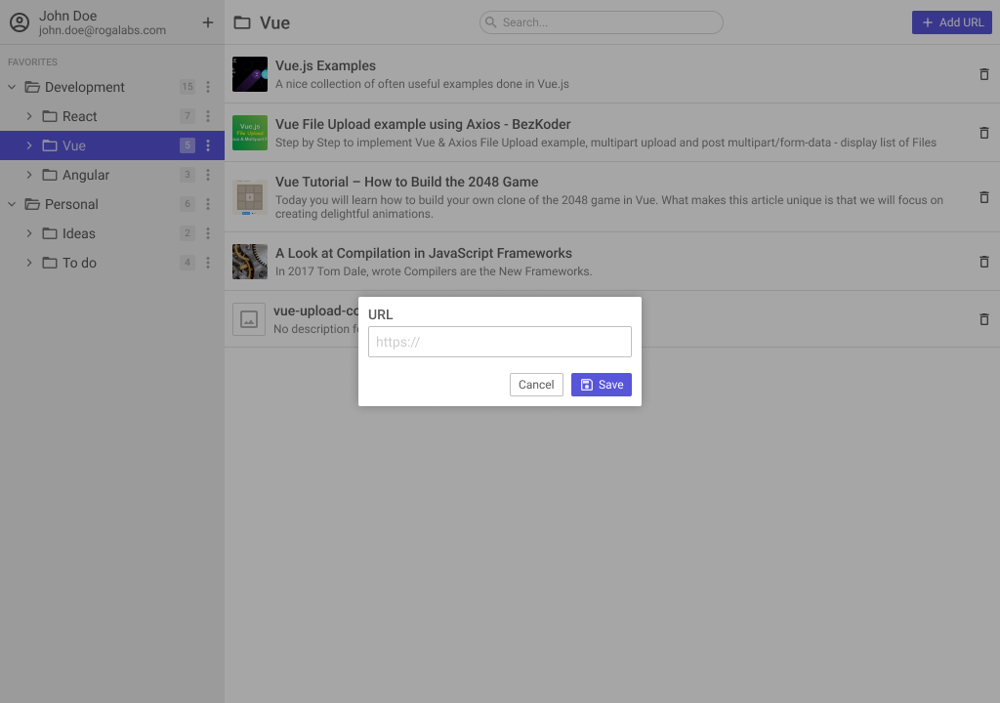

# Bookmark Manager

## Pré-requisitos

- Node.js 16+
- Criar os componentes visuais usando [Web Components](https://developers.google.com/web/fundamentals/web-components/customelements)
- Não utilizar nenhuma biblioteca além daquelas que já estão instaladas (seja de CSS ou JS)

## Passo 1

- Instalar as dependências
- Escrever testes unitários significativos para o aplicativo (Jest)
- Escrever as classes para passar nos testes

## Passo 2

- Criar a interface baseada no [protótipo do Figma](https://www.figma.com/file/fJ43ch89xzrAcCl5aN16JT/Bookmark-Manager)
- Fazer a aplicação responsiva utilizando as classes criadas no passo anterior
- Utilizar o endpoint `/api/extract` para obter os metadados das URLs

## Sugestões

- Faça bom uso de variáveis CSS
- Utilize os recursos mais novos de JavaScript (ESNext)

## O que será avaliado

- Todos os testes cumpridos
- Uso de Web Components
- Fidelidade ao protótipo
- Responsividade
- Estrutura do código (padrões, estrutura de pastas, etc)
- Gerenciamento de estados (store/state/routes/etc)
- Uso de boas práticas (legibilidade, código limpo, etc)
- Funcionalidades adicionais são bem-vindas (use sua criatividade)

## Resultado esperado

-- _Empty State_

-- _Menu hover_

-- _Menu active_

-- _Menu actions_

-- _Add/Edit group_

-- _Add URL_
